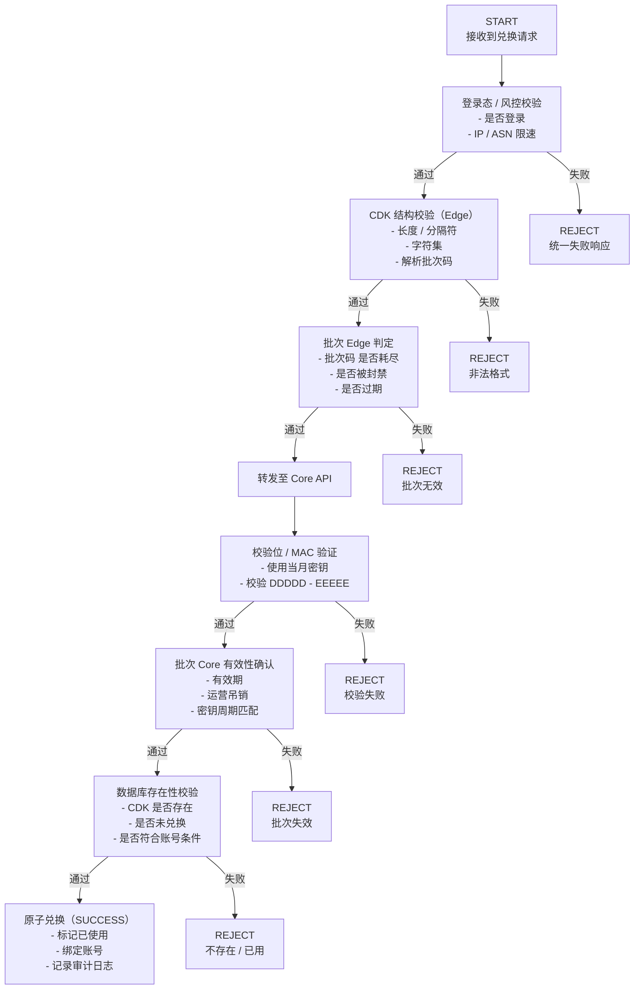
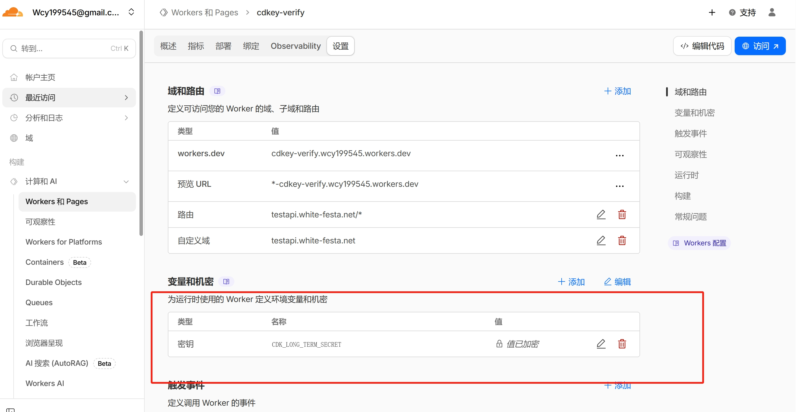
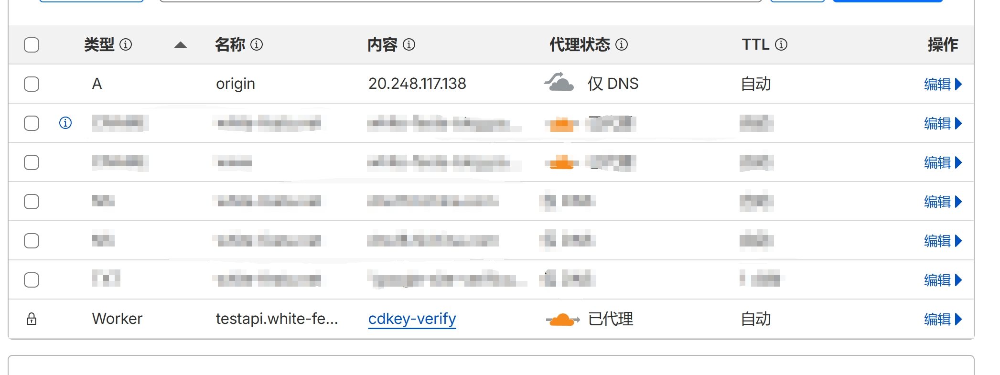
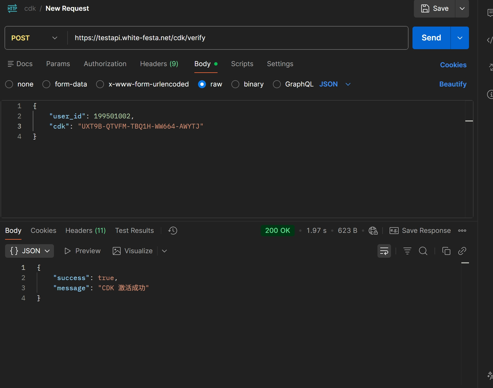
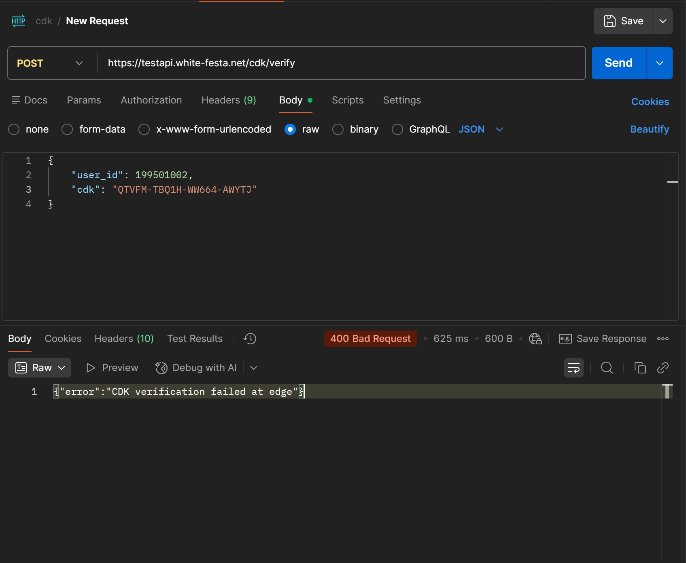
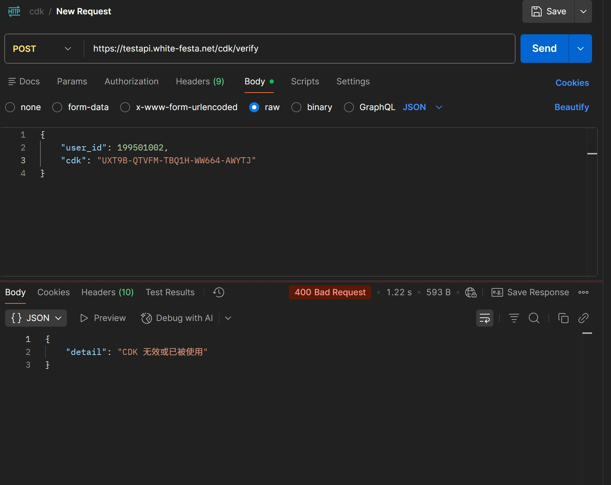

# 一、系统介绍
该系统目的是实现对高价值礼品码商品的兑换，需要确保系统的高并发能力、可用性、CDK防破解等问题。
因此，引入了边缘计算节点、边缘缓存与中心化后端和数据库的架构，其中边缘节点用于否定“必然失败的请求”、实现访问速率限制等功能，防止撞库、暴力枚举等黑产破解技术产生的并发压力给到后端节点和数据库，影响可用性；
中心化后端和数据库是为了实现原子事务更新，防止超卖，逻辑兑换成功但数据库未写入等漏洞。
# 二、CD-KEY语义化设计、发放机制
## 1. CD-KEY分段解释
```bash
AAAAA-BBBBB-CCCCC-DDDDD-EEEEE
```
其中：
- AAAAA：纯随机载荷1
- BBBBB：经HMAC算法和密钥加密后产生的批次码，内含语义化的批次（如日期20250821），通过HMAC算法加密后取前4字节，再通过Base32编码取其中5位。
- CCCCC：纯随机载荷2
- DDDDD/EEEEE：通过AAAAA、BBBBB、CCCCC配合HMAC计算出的校验位，截取并通过Base32算法重新编码为10位的校验码。
## 2. 代码实现
```python
import hmac
import string
import secrets
import base64
import struct
from datetime import datetime

# 从环境变量获取根密钥 (必须与验证器一致!)
import os
CDK_LONG_TERM_SECRET = os.environ.get("CDK_LONG_TERM_SECRET", "your_32_byte_secure_secret_here").encode()

CHARSET = string.digits + string.ascii_uppercase

def get_random(charset: str, length: int) -> str:
    return ''.join(secrets.choice(charset) for _ in range(length))

def get_batch_code(date: str) -> str:
    # 派生每日密钥: HMAC(root_secret, date)
    daily_key = hmac.new(CDK_LONG_TERM_SECRET, date.encode(), 'sha256').digest()
    # 生成批次码: HMAC(daily_key, "batch_code")
    mac = hmac.new(daily_key, b"batch_code", 'sha256').digest()
    value = struct.unpack(">I", mac[:4])[0]
    b32 = base64.b32encode(struct.pack(">I", value)).decode()
    return b32[:5]

def get_verification_code(r1: str, r2: str, batch_code: str) -> tuple[str, str]:
    # 派生验证密钥: HMAC(root_secret, "verification")
    verif_key = hmac.new(CDK_LONG_TERM_SECRET, b"verification", 'sha256').digest()
    msg = (batch_code + r1 + r2).encode()
    mac = hmac.new(verif_key, msg, 'sha256').digest()
    mac_part = mac[:8]
    b32 = base64.b32encode(mac_part).decode()
    return b32[:5], b32[5:10]

def main():
    # 使用当前日期 (UTC)
    date = datetime.utcnow().strftime("%Y%m%d")
    for i in range(6):
        # print(get_batch_code(date))
        r1 = get_random(CHARSET, 5)
        r2 = get_random(CHARSET, 5)
        
        bc = get_batch_code(date)
        v1, v2 = get_verification_code(r1, r2, bc)
        
        print(f"{r1}-{bc}-{r2}-{v1}-{v2}")

if __name__ == "__main__":
    main()
```
这种加密方式的最大优点是没有可逆性，不存在逆向破解的可能
- HMAC本身是不可逆算法，只能通过密钥解码
- Base32编码是基于被截断的HMAC生成的，自身缺失大量信息

## 3. 如何在边缘节点上验证合法性
这里需要注意的一点是，边缘节点只验证CDK的合法性，而不验证具体内容，因此重点围绕的是后两位校验码。
在边缘节点上通过输入的CDK，提取到两段随机载荷+批次码后，利用自己的密钥重新生成一次校验码，并检查与CDK中包含的校验码是否一致，只有一致时才被视为合法的，随机载荷部分只能最终通过中心化数据库进行校验。

## 4. 暴力枚举成功概率分析
攻击者如果想要构造出一个能够经过边缘节点合法验证的CDK，必须完美猜测出两段随机载荷，加上有效批次码，单次猜出的概率大概是8.1 × 10^-21，这是极低的概率，即使攻击者每秒可以暴力尝试100万次，在尝试100年后成功率也仅有0.0000026%，因此，这是密码学的安全级别。

# 三、校验流程
```txt
客户端
  ↓
Edge（Cloudflare Workers / Edge）
  ↓
Core API（中心服务）
  ↓
数据库（最终真相）
```
## 1. 边缘层校验
- 输入：HTTP请求、登录态、Session/Token、IP/ASN/地理信息
- 校验内容：是否已登录、是否有IP速率限制(如IP在云厂商IP列表中)、是否存在临时/永久封禁标记
- 失败处理：返回统一错误信息和状态码
- 本层目的：用最少的资源将自动化/低成本攻击阻挡在系统最外围

## 2. CDK格式与结构校验
- 输入：CDK字符串
- 校验内容：CDK长度、格式、字符集、是否能够解析出批次码
- 失败处理：返回统一错误信息和状态码
- 本层目的：过滤脚本流量、避免触发任何密码学校验逻辑，造成计算资源浪费

## 3. 批次校验
- 输入：解析出的批次码
- 校验内容：缓存在边缘节点的批次码列表，是否是被记录为：批次已兑换完成、批次已作废等不被允许使用的状态
- 失败处理：返回统一错误信息和状态码
- 本层目的：用时间复杂度为O(1)的缓存查询，拒绝大量的无意义请求

## 4. Core 层校验流程(可信请求)
- 输入：完整CDK、自身存储的当月校验密钥
- 校验内容：检查批次码是否仍有效、利用两段随机载荷+批次码重新计算校验位、对比两者的校验位是否一致
- 失败处理：返回统一错误信息和状态码、记录用户失败次数、计算单位时间内的失败率
- 本层目的：确保请求不是随机构造或格式伪造。
## 5. 数据库存在性与状态校验(最终判定)
- 输入：完整的CDK、用户id
- 校验内容：CDK是否存在、是否未被使用、是否符合对应用户的兑换条件
- 失败处理：返回统一错误信息和状态码、记录用户失败次数、计算单位时间内的失败率、标记高风险兑换行为(疑似泄露)
- 目的：最终校验
## 6. 原子性兑换(成功路径)
操作：
- 标记CDK为已使用
- 绑定兑换者(user id)
- 记录兑换时间等信息
后续操作：
- 检查对应批次的兑换情况，若已整批次兑换完毕，通知边缘节点尽快将对应的批次码加入否决缓存列表
目的：避免并发兑换、重放攻击
## 7. 状态机


# 四、云架构
基于CloudFlare Workers、CloudFlare KV、Azure Kubernetes和Azure Database for MySQL的半Serverless架构
## 1. 服务介绍
### 1.1 Cloudflare Workers：边缘计算平台
Cloudflare Workers 允许开发者在距离用户最近的边缘节点上运行代码（JavaScript, Rust, Python 等）。
- 技术原理： 不同于传统的容器或虚拟机，Workers基于V8 Isolates 技术。这使得它的启动速度极快，完全没有传统 Serverless，比如 AWS Lambda的“冷启动”延迟。
- 核心优势：
    - 极低延迟： 代码直接在用户附近的网关上运行。
    - 高并发： 轻松处理每秒数百万次的请求。
    - 成本极低： 免费额度慷慨（`每天10万次`请求），付费版起步价也很具竞争力。

### 1.2 Azure Kubernetes
Azure Kubernetes Service（AKS）是微软 Azure 提供的托管式 Kubernetes 服务，可让你在云中快速部署、管理和扩展容器化应用，而无需维护底层 Kubernetes 控制平面。

### 1.3 Azure Database for MySQL
Azure Database for MySQL 是微软 Azure 提供的完全托管的关系数据库服务，基于 MySQL 社区版引擎构建，允许开发者在云端托管、管理和缩放MySQL数据库，而无需处理底层服务器基础设施。
优点：自动化运维、99.9%可用时间

## 2. 配置边缘层
:::tip
以下所有代码相关的部分都是最小实现，只用来演示架构的用法，部分技术未使用（比如KV）。
:::

### 2.1 Node后端代码和Workers部署
目录结构如下：
```txt
.
├── package-lock.json
├── package.json
├── workers
│   └── cdk_verify.js
└── wrangler.toml
```
其中workers/cdkey.js是后端文件，wrangler.toml是配置文件
Node后端代码：
```js
// ===== 可配置项 =====
const BACKEND_VERIFY_URL = 'http://origin.white-festa.net/cdk/verify';
const VERIFICATION_SALT = 'verification';

// 5 × 5 CDK 格式
const CDK_FORMAT = /^[A-Z0-9]{5}(-[A-Z0-9]{5}){4}$/;

/**
 * Base32 (RFC4648, no padding)
 */
function base32Encode(input) {
  const ALPHABET = 'ABCDEFGHIJKLMNOPQRSTUVWXYZ234567';
  let output = '';
  let bits = 0;
  let value = 0;

  for (const byte of input) {
    value = (value << 8) | byte;
    bits += 8;
    while (bits >= 5) {
      output += ALPHABET[(value >>> (bits - 5)) & 31];
      bits -= 5;
    }
  }

  if (bits > 0) {
    output += ALPHABET[(value << (5 - bits)) & 31];
  }

  return output;
}

/**
 * HMAC-SHA256 (WebCrypto)
 */
async function hmacSha256(keyBytes, msgBytes) {
  const key = await crypto.subtle.importKey(
    'raw',
    keyBytes,
    { name: 'HMAC', hash: 'SHA-256' },
    false,
    ['sign']
  );
  const sig = await crypto.subtle.sign('HMAC', key, msgBytes);
  return new Uint8Array(sig);
}

/**
 * 重新计算 v1 / v2
 */
async function getVerificationCode(r1, r2, bc, longTermSecret) {
  const encoder = new TextEncoder();

  const verifKey = await hmacSha256(
    encoder.encode(longTermSecret),
    encoder.encode(VERIFICATION_SALT)
  );

  const msg = encoder.encode(`${bc}${r1}${r2}`);
  const mac = await hmacSha256(verifKey, msg);

  const macPart = mac.slice(0, 8); // 64 bit
  const b32 = base32Encode(macPart);

  return [b32.slice(0, 5), b32.slice(5, 10)];
}

/**
 * Edge 校验 CDK
 */
async function edgeVerifyCDK(cdk, env) {
  if (!CDK_FORMAT.test(cdk)) {
    return false;
  }

  const [r1, bc, r2, v1Given, v2Given] = cdk.split('-');
  const [v1Exp, v2Exp] = await getVerificationCode(
    r1,
    r2,
    bc,
    env.CDK_LONG_TERM_SECRET
  );

  return v1Given === v1Exp && v2Given === v2Exp;
}

// ======================
// Worker 入口
// ======================

export default {
  
  async fetch(request, env) {
    // 1. 仅允许 POST
    if (request.method !== 'POST') {
      return new Response(
        JSON.stringify({ error: 'Method Not Allowed' }),
        { status: 405 }
      );
    }

    // 2. 解析 JSON 请求体
    let body;
    try {
      body = await request.json();
    } catch {
      return new Response(
        JSON.stringify({ error: 'Invalid JSON body' }),
        { status: 400 }
      );
    }

    const { user_id: userId, cdk } = body || {};

    if (!userId || !cdk) {
      return new Response(
        JSON.stringify({ error: 'missing user_id or cdk' }),
        { status: 400 }
      );
    }

    // 3. Edge 校验
    const edgeVerifyResult = await edgeVerifyCDK(cdk, env);
    if (!edgeVerifyResult) {
      return new Response(
        //这里在实际生产中建议前后端的返回值和状态码保持一致，防止攻击者摸清结构
        JSON.stringify({ error: 'CDK verification failed at edge' }),
        { status: 400 }
      );
    }

    // 4. 构造转发载荷
    const payload = {
      user_id: userId,
      cdk,
      edge_verify: edgeVerifyResult,
      timestamp: Math.floor(Date.now() / 1000)
    };

    // 5. 转发给后端
    const backendResp = await fetch(BACKEND_VERIFY_URL, {
      method: 'POST',
      headers: {
        'Content-Type': 'application/json',
        'User-Agent': 'PostmanRuntime/7.51.0',
        'Accept': '*/*',
        'Connection': 'keep-alive'
      },
      body: JSON.stringify(payload)
    });

    // 6. 透传后端响应
    return new Response(await backendResp.text(), {
      status: backendResp.status,
      headers: {
        'Content-Type': 'application/json'
      }
    });
  }
};
```

### 2.2 wrangler配置
完成wrangler配置如下：
```toml
name = "cdkey-verify" # Workers应用名称
main = "workers/cdkey.js" # 主程序文件
compatibility_date = "2024-12-25"
compatibility_flags = ["nodejs_compat"] # 兼容Node应用

# 以下是日志配置，启用日志便于debug
[observability]
enabled = false
head_sampling_rate = 1

[observability.logs]
enabled = true
head_sampling_rate = 1
persist = true
invocation_logs = true

[observability.traces]
enabled = false
persist = true
head_sampling_rate = 1
```
### 2.3. 部署程序
1. 确保wrangler已安装

如果没有安装，使用npm安装
```bash
npm install -g wrangler
```
2. 登录CloudFlare
```bash
wrangler login
```
这一步会自动唤起浏览器并进入CloudFlare获取授权
3. Deploy
```bash
wrangler deploy
```
如果没有任何报错，则workers已经部署成功
### 2.4. 在Cloudflare中配置workers
1. 配置密钥

将密钥配置在环境变量中供worker调用并重新计算校验位

2. 为Azure Kubernetes Service配置临时域名

Cloudflare默认禁止直接向裸IP地址发送请求，因此必须为AKS暴露的服务配置域名，可以是非HTTPS，但必须有域名，否则请求会被Cloudflare自动返回403，响应体返回 `error: 1003`
:::tip
这个部分需要完成后端部署才会有服务IP
:::



## 3. 部署和配置Azure Database for MySQL
这部分没什么好说的，只需要登录Azure部署资源，其实只要能够被访问到，任何云厂商的MySQL数据库都一样。
唯一注意的点是需要允许外部访问数据库(实验环境中可以设置安全组为0.0.0.0、生产环境下不可以)
:::tip
安全组设置为0.0.0.0建议只在测试、实验环境下；敏感、生产环境中请手动下载 [Cloudflare IP地址范围](https://www.cloudflare.com/ips-v4/) 
:::
### 3.1 创建数据库、表和索引
:::tip
在实际生产环境下，需要更完善的数据表结构，包括兑换者id、状态、批次码、完整CDKEY、通过随机载荷和批次码生成的完整HMAC码等等内容，这里还是最小实现
:::
```sql
-- 创建数据库
CREATE DATABASE cdk;
-- 创建数据表
CREATE TABLE cdk (
    id INT NOT NULL PRIMARY KEY AUTO_INCREMENT,
    cdk VARCHAR(64) NOT NULL UNIQUE,
    used BOOLEAN NOT NULL DEFAULT FALSE,
    used_by INT NULL,
    used_at DATETIME NULL,
    content VARCHAR(50) NOT NULL,
    
    INDEX idx_cdk (cdk),
    INDEX idx_id (id)
) ENGINE=InnoDB DEFAULT CHARSET=utf8mb4 COLLATE=utf8mb4_unicode_ci;
```
### 3.2 注入测试数据
```sql
INSERT INTO cdk (cdk, content) VALUES
('NUZOQ-QTVFM-14YMQ-6PBEP-BYBDJ', '1000 coins'),
('TH3T3-QTVFM-K8OAC-PSY63-XJOF2', '1000 coins'),
('UXT9B-QTVFM-TBQ1H-WW664-AWYTJ', '1000 coins'),
('HZOY6-QTVFM-8ZL53-YNIDE-4A3XN', '1000 coins'),
('FQM9I-QTVFM-XB6QR-VNCY4-F32PB', '1000 coins'),
('PXIWX-QTVFM-5LJEJ-KLYSP-6QIUB', '1000 coins');
```

## 4.部署AKS后端
### 4.1 后端代码

https://github.com/chunyiw8080/cdk-backend.git

### 4.2 编写Dockerfile并打包为镜像
```Dockerfile
FROM python:3.12.2

WORKDIR /cdk

COPY requirements.txt ./

RUN pip install --no-cache-dir -r requirements.txt

COPY . .

ENV PYTHONDONTWRITEBYTECODE=1
ENV PYTHONUNBUFFERED=1

EXPOSE 8000

CMD ["uvicorn", "app.main:app", "--host", "0.0.0.0", "--port", "8000", "--proxy-headers"]
```
打包为镜像
```bash
docker build -t cdkeyappacr.azurecr.io/cdk-backend/backend:3 -f ./deployments/Dockerfile .
```
上传镜像
```bash
# 首先登录Azure Container Registry
az login
az acr login --name cdkeyappacr
# 推送镜像
docker push cdkeyappacr.azurecr.io/cdk-backend/backend:3
```

### 4.3 编写Kubernetes deployment、service和autoscale
```yaml
---
apiVersion: apps/v1
kind: Deployment
metadata:
  name: cdk-app
  labels:
    app: cdk-app
spec:
  replicas: 2
  selector:
    matchLabels:
      app: cdk-app
  template:
    metadata:
      labels:
        app: cdk-app
    spec:
      containers:
        - name: cdk-app
          image: cdkeyappacr.azurecr.io/cdk-backend/backend:3
          ports:
            - containerPort: 8000
          env:
            - name: PYTHONUNBUFFERED
              value: "1"
          resources:
            requests:
              memory: "128Mi"
              cpu: "100m"
            limits:
              memory: "256Mi"
              cpu: "500m"
          livenessProbe:
            httpGet:
              path: /health 
              port: 8000
            initialDelaySeconds: 10
            periodSeconds: 15
          readinessProbe:
            httpGet:
              path: /health
              port: 8000
            initialDelaySeconds: 5
            periodSeconds: 10
---
apiVersion: v1
kind: Service
metadata:
  name: cdk-app-service
spec:
  type: LoadBalancer
  ports:
    - port: 80
      targetPort: 8000
      protocol: TCP
  selector:
    app: cdk-app
---
apiVersion: autoscaling/v2
kind: HorizontalPodAutoscaler
metadata:
  name: cdk-app-hpa
spec:
  scaleTargetRef:
    apiVersion: apps/v1
    kind: Deployment
    name: cdk-app
  minReplicas: 2
  maxReplicas: 10
  metrics:
    - type: Resource
      resource:
        name: cpu
        target:
          type: Utilization
          averageUtilization: 70
    - type: Resource
      resource:
        name: memory
        target:
          type: Utilization
          averageUtilization: 80
```
### 4.4 部署
1. 将本地kubernetes上下文切换为AKS
```bash
# 登录
az login
# 设置集群订阅
az account set --subscription your_subscription_id
# 下载集群凭据
az aks get-credentials --resource-group your_res_group --name your_cluster_name --overwrite-existing
# 确保你的上下文名称和AKS一致
kubectl config current-context
```
2. 部署
```bash
kubectl apply -f ./deployments/deployment.yaml
```

# 五、测试
## 1. 测试激活有效CDK

## 2. 测试激活不合法的CDK

可以发现请求在边缘节点就被拒绝了，因为没有通过密码学验证
## 3. 测试激活已使用的CDK

这里请求还是走到后端了，因为这个CDK在密码学校验是合法的，而边缘节点不保存CDK的使用状态，因此必须发送到后端做二次验证

# 六、该架构解决了什么问题
1. 超过99%的非法、格式错误或暴力枚举请求在边缘层被拦截，显著降低后端服务与数据库压力
2. 通过批次码+KV缓存机制，实现单条KV记录拒绝上千条无效礼品码请求，边缘处理复杂度保持在O(1)，且无需访问后端（在这个实现中KV没有引入，不过可以轻松扩展）
3. 配合速率限制与IP风控策略，使礼品码暴力枚举攻击的实际成本提升多个数量级
4. 在多地域部署场景下，数据库访问延迟平均降低约 10–20ms（视节点位置）
5. 利用Cloudflare边缘防护能力，在低成本方案下即可应对中等规模的恶意流量冲击，保障服务稳定性
6. 后端仅处理高价值请求，整体云资源使用率与数据库负载显著下降
