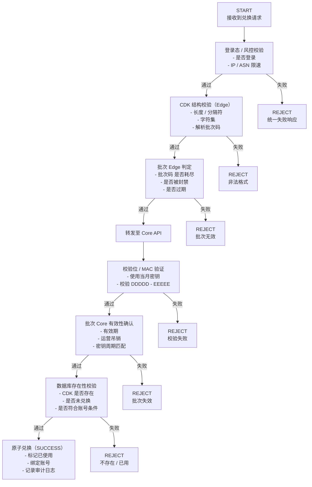
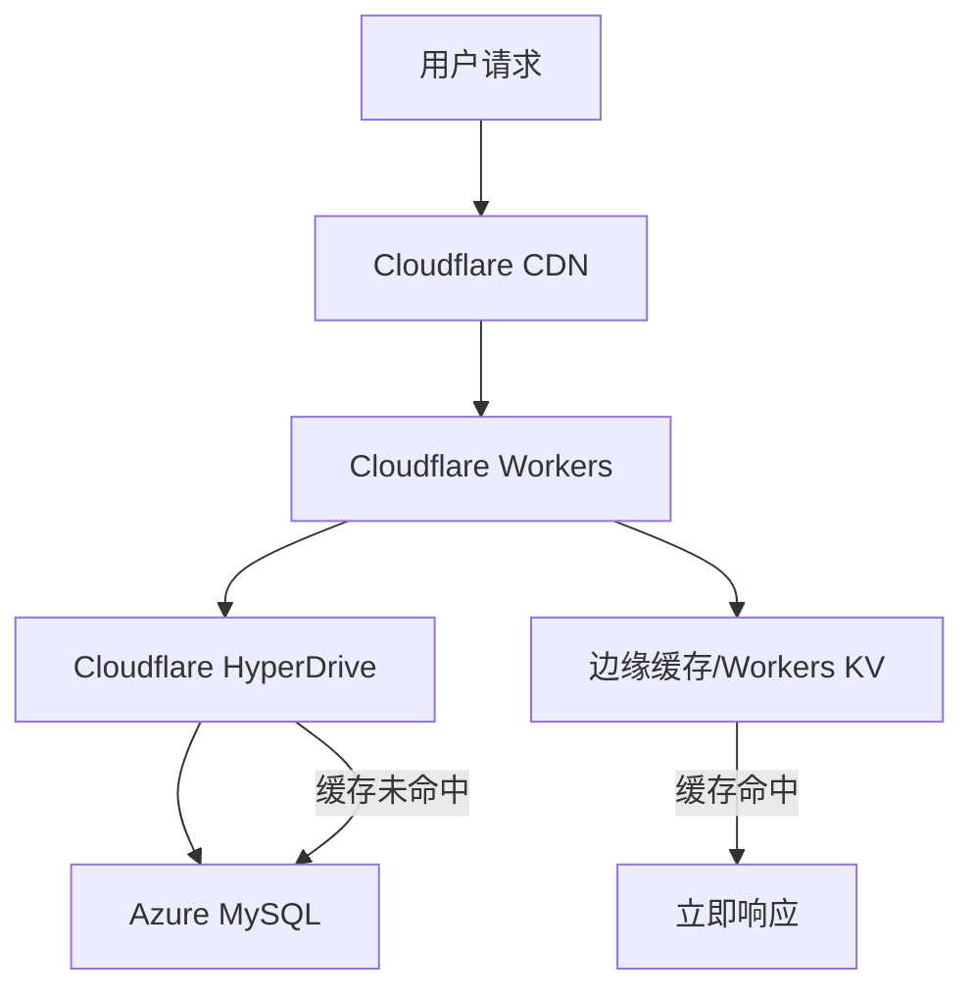
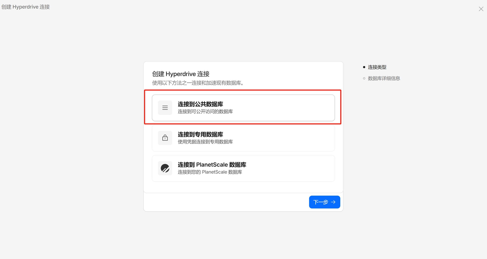
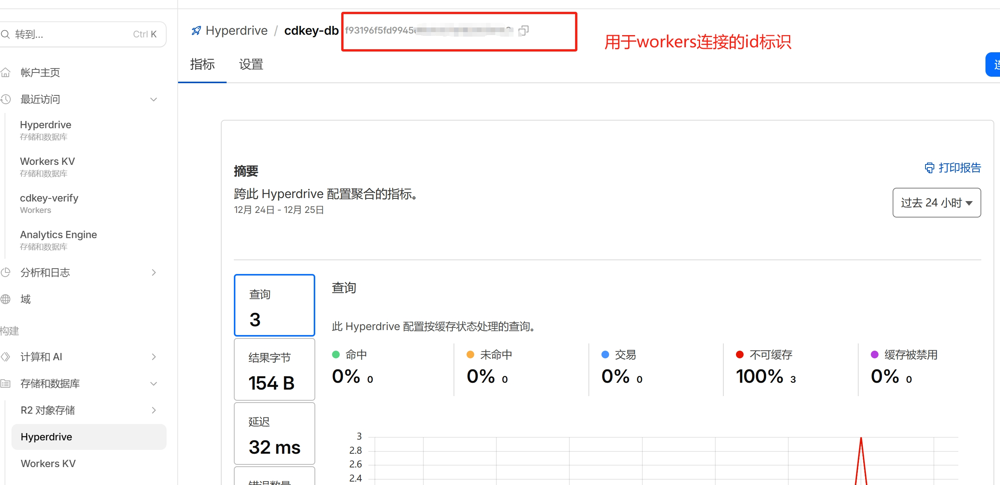
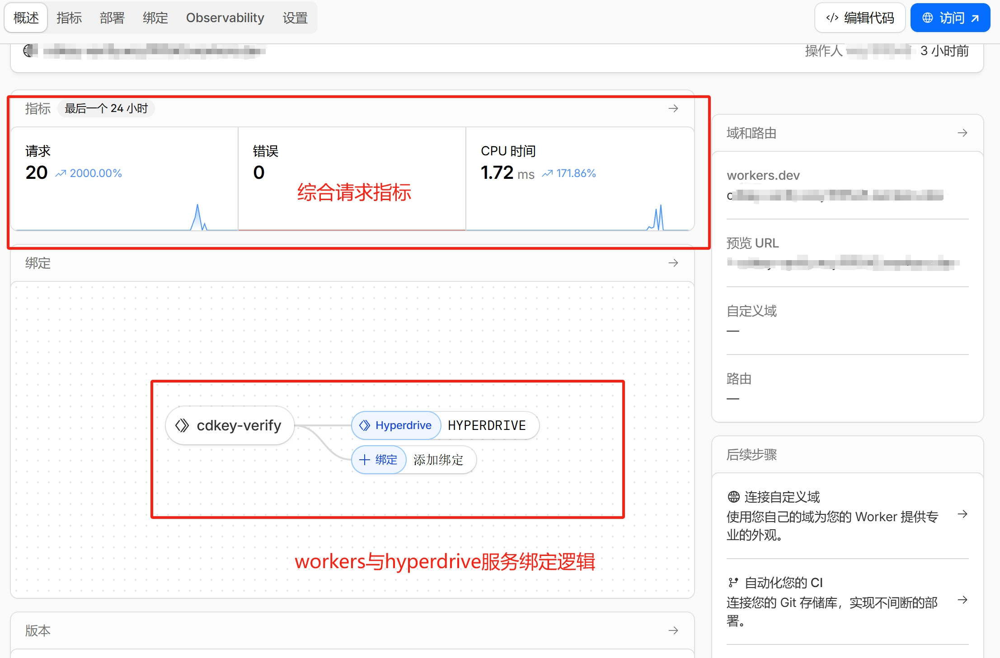
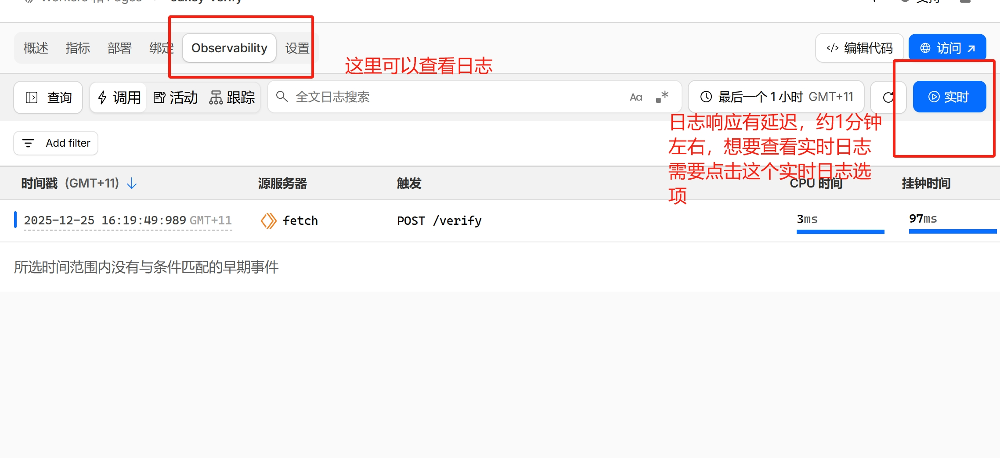

# 一、系统介绍
该系统目的是实现对高价值礼品码商品的兑换，需要确保系统的高并发能力、可用性、CDK防破解等问题。
因此，引入了边缘计算节点、边缘缓存与中心化后端和数据库的架构，其中边缘节点用于否定“必然失败的请求”、实现访问速率限制等功能，防止撞库、暴力枚举等黑产破解技术产生的并发压力给到后端节点和数据库，影响可用性；
中心化后端和数据库是为了实现原子事务更新，防止超卖，逻辑兑换成功但数据库未写入等漏洞。
# 二、CD-KEY语义化设计、发放机制
## 1. CD-KEY分段解释
```bash
AAAAA-BBBBB-CCCCC-DDDDD-EEEEE
```
其中：
- AAAAA：纯随机载荷1
- BBBBB：经HMAC算法和密钥加密后产生的批次码，内含语义化的批次（如日期20250821），通过HMAC算法加密后取前4字节，再通过Base32编码取其中5位。
- CCCCC：纯随机载荷2
- DDDDD/EEEEE：通过AAAAA、BBBBB、CCCCC配合HMAC计算出的校验位，截取并通过Base32算法重新编码为10位的校验码。
## 2. 代码实现
```python
import hmac
import string
import secrets
import base64
import struct

charset = string.digits + string.ascii_uppercase

def get_random(charset: str, length: int) -> str:
    # 获取5字符随机载荷
    return ''.join(secrets.choice(charset) for _ in range(length))

def get_batch_code(date: str, date_key: bytes) -> str:
    mac = hmac.new(date_key, date.encode(), 'sha256').digest()
    # 取前 4 字节 = 32 bit
    value = struct.unpack(">I", mac[:4])[0]
    # Base32 编码整数
    b32 = base64.b32encode(struct.pack(">I", value)).decode()
    return b32[:5]

def get_verification_code(r1: str, r2: str, batch_code: str, verification_key: bytes) -> tuple[str, str]:
    msg = (batch_code + r1 + r2).encode()

    mac = hmac.new(verification_key, msg, 'sha256').digest()

    # 取前 8 字节 = 64 bit
    mac_part = mac[:8]
    b32 = base64.b32encode(mac_part).decode()

    return b32[:5], b32[5:10]

def main():
    date = "20250821"
    date_key = b"20250821key"
    verification_key = b"verification_key"

    r1 = get_random(charset, 5)
    r2 = get_random(charset, 5)

    bc = get_batch_code(date, date_key)
    v1, v2 = get_verification_code(r1, r2, bc, verification_key)

    print("CDK:", f"{r1}-{bc}-{r2}-{v1}-{v2}")

if __name__ == "__main__":
    main()
```
这种加密方式的最大优点是没有可逆性，不存在逆向破解的可能
- HMAC本身是不可逆算法，只能通过密钥解码
- Base32编码是基于被截断的HMAC生成的，自身缺失大量信息

## 3. 如何在边缘节点上验证合法性
这里需要注意的一点是，边缘节点只验证CDK的合法性，而不验证具体内容，因此重点围绕的是后两位校验码。
在边缘节点上通过输入的CDK，提取到两段随机载荷+批次码后，利用自己的密钥重新生成一次校验码，并检查与CDK中包含的校验码是否一致，只有一致时才被视为合法的，随机载荷部分只能最终通过中心化数据库进行校验。

## 4. 暴力枚举成功概率分析
攻击者如果想要构造出一个能够经过边缘节点合法验证的CDK，必须完美猜测出两段随机载荷，加上有效批次码，单次猜出的概率大概是8.1 × 10^-21，这是极低的概率，即使攻击者每秒可以暴力尝试100万次，在尝试100年后成功率也仅有0.0000026%，因此，这是密码学的安全级别。

# 三、校验流程
```txt
客户端
  ↓
Edge（Cloudflare Workers / Edge）
  ↓
Core API（中心服务）
  ↓
数据库（最终真相）
```
## 1. 边缘层校验
- 输入：HTTP请求、登录态、Session/Token、IP/ASN/地理信息
- 校验内容：是否已登录、是否有IP速率限制(如IP在云厂商IP列表中)、是否存在临时/永久封禁标记
- 失败处理：返回统一错误信息和状态码
- 本层目的：用最少的资源将自动化/低成本攻击阻挡在系统最外围

## 2. CDK格式与结构校验
- 输入：CDK字符串
- 校验内容：CDK长度、格式、字符集、是否能够解析出批次码
- 失败处理：返回统一错误信息和状态码
- 本层目的：过滤脚本流量、避免触发任何密码学校验逻辑，造成计算资源浪费

## 3. 批次校验
- 输入：解析出的批次码
- 校验内容：缓存在边缘节点的批次码列表，是否是被记录为：批次已兑换完成、批次已作废等不被允许使用的状态
- 失败处理：返回统一错误信息和状态码
- 本层目的：用时间复杂度为O(1)的缓存查询，拒绝大量的无意义请求

## 4. Core 层校验流程(可信请求)
- 输入：完整CDK、自身存储的当月校验密钥
- 校验内容：检查批次码是否仍有效、利用两段随机载荷+批次码重新计算校验位、对比两者的校验位是否一致
- 失败处理：返回统一错误信息和状态码、记录用户失败次数、计算单位时间内的失败率
- 本层目的：确保请求不是随机构造或格式伪造。
## 5. 数据库存在性与状态校验(最终判定)
- 输入：完整的CDK、用户id
- 校验内容：CDK是否存在、是否未被使用、是否符合对应用户的兑换条件
- 失败处理：返回统一错误信息和状态码、记录用户失败次数、计算单位时间内的失败率、标记高风险兑换行为(疑似泄露)
- 目的：最终校验
## 6. 原子性兑换(成功路径)
操作：
- 标记CDK为已使用
- 绑定兑换者(user id)
- 记录兑换时间等信息
后续操作：
- 检查对应批次的兑换情况，若已整批次兑换完毕，通知边缘节点尽快将对应的批次码加入否决缓存列表
目的：避免并发兑换、重放攻击
## 7. 状态机


# 四、云架构
基于CloudFlare Workers、CloudFlare KV、CloudFlare HyperDrive、Azure Functions和Azure Database for MySQL的半Serverless架构
## 1. 服务介绍
### 1.1 Cloudflare Workers：边缘计算平台
Cloudflare Workers 允许开发者在距离用户最近的边缘节点上运行代码（JavaScript, Rust, Python 等）。
- 技术原理： 不同于传统的容器或虚拟机，Workers基于V8 Isolates 技术。这使得它的启动速度极快，完全没有传统 Serverless，比如 AWS Lambda的“冷启动”延迟。
- 核心优势：
    - 极低延迟： 代码直接在用户附近的网关上运行。
    - 高并发： 轻松处理每秒数百万次的请求。
    - 成本极低： 免费额度慷慨（`每天10万次`请求），付费版起步价也很具竞争力。

### 1.2 Azure Functions
Azure Functions 是 Azure 提供的 Serverless（无服务器）计算服务，采用 FaaS（Function as a Service） 模型。开发者只需编写函数级别的业务代码，无需管理服务器或运行环境。函数通过 HTTP 请求、定时器或各类事件触发执行，平台会自动完成资源分配与弹性扩缩容，并按实际执行量计费。

### 1.3 Azure Database for MySQL
Azure Database for MySQL 是微软 Azure 提供的完全托管的关系数据库服务，基于 MySQL 社区版引擎构建，允许开发者在云端托管、管理和缩放MySQL数据库，而无需处理底层服务器基础设施。
优点：自动化运维、99.9%可用时间

### 1.4 CloudFlare HyperDrive
Cloudflare Hyperdrive 是一项专门为解决“边缘计算访问远程数据库延迟高”而设计的加速服务。它能让你部署在 Cloudflare Workers 上的无服务器应用，以接近本地速度访问位于全球任何地方的传统数据库。
优势：
- 传统数据库连接需要多次网络往返（TCP、TLS 及数据库认证）。Hyperdrive在Cloudflare网络中维持一个长连接池，将连接时间从`数百ms`降至`35ms`左右。
:::tip
实际延迟取决于数据库所在区域、查询复杂度和缓存命中率。
:::
- 智能查询缓存：自动识别读取查询，并将频繁请求的结果缓存至边缘节点。对于缓存命中的查询，延迟通常低于`5ms`，且不会消耗数据库性能。
- 网络路径优化：即使缓存未命中，Hyperdrive也会通过Cloudflare 的骨干网络优化路由，减少从Workers到源数据库的传输延迟。
## 2. 架构实现(最小实现)
:::tip
以下所有代码相关的部分都是最小实现，只用来演示架构的用法，功能是非常不完全的。
:::
先看架构图：

:::tip
本文最小实现未启用 KV，KV部分仅作为后续扩展思路
:::
目录结构如下：
```txt
.
├── package-lock.json
├── package.json
├── workers
│   └── cdkey.js
└── wrangler.toml
```
其中workers/cdkey.js是后端文件，wrangler.toml是配置文件
### 2.1 Node后端代码和Workers部署
Node后端代码：
```js
import mysql from "mysql2/promise";

const CDK_REGEX = /^[A-Z0-9]{5}(-[A-Z0-9]{5}){4}$/;

export default {
  async fetch(request, env) {
    const url = new URL(request.url);

    if (request.method === "POST" && url.pathname === "/verify") {
      return handleVerify(request, env);
    }

    if (request.method === "POST" && url.pathname === "/add") {
      return handleAdd(request, env);
    }

    return new Response("Not Found", { status: 404 });
  },
};

/**
 * 创建 Hyperdrive MySQL 连接
 * ⚠️ 每次请求新建连接，Worker 不能做全局长连接
 */
async function getConnection(env) {
  return mysql.createConnection(env.HYPERDRIVE.connectionString);
}

/**
 * CDKey 验证（原子更新）
 */
async function handleVerify(request, env) {
  let conn;

  try {
    const { code } = await request.json();

    // ① 结构校验
    if (!code || !CDK_REGEX.test(code)) {
      return json({ error: "Invalid CDKey format" }, 400);
    }

    const parsed = parseCDK(code);

    // ② Edge 批次否决
    if (await isBatchBlocked(parsed.batch, env)) {
      return json({ error: "CDKey batch exhausted" }, 400);
    }

    // ③ MAC 校验
    const macOk = await verifyMAC(parsed, env);
    if (!macOk) {
      return json({ error: "Invalid CDKey" }, 400);
    }

    // ④ 最终数据库原子验证
    conn = await getConnection(env);
    const escapedCode = conn.escape(code);

    const [result] = await conn.query(
      `UPDATE cdkeys
       SET is_used = 1, used_at = NOW()
       WHERE code = ${escapedCode} AND is_used = 0`
    );

    if (result.affectedRows === 1) {
      return json({ success: true });
    }

    return json({ error: "Invalid or already used CDKey" }, 400);

  } catch (err) {
    console.error("verify error:", err);
    return json({ error: "Verification failed" }, 500);
  } finally {
    if (conn) await conn.end();
  }
}

/**
 * CDKey 批量上传（最多 100）
 */
async function handleAdd(request, env) {
  let conn;

  try {
    const { codes } = await request.json();

    if (!Array.isArray(codes) || codes.length === 0 || codes.length > 100) {
      return json(
        { error: "Invalid input: expect array of 1-100 codes" },
        400
      );
    }

    const validCodes = codes.filter((code) =>
      !CDK_REGEX.test(code)
    );

    if (validCodes.length === 0) {
      return json({ error: "No valid CDKeys found" }, 400);
    }

    conn = await getConnection(env);

    const values = validCodes
      .map((code) => `(${conn.escape(code)})`)
      .join(",");

    await conn.query(
      `INSERT IGNORE INTO cdkeys (code) VALUES ${values}`
    );

    return json({
      success: true,
      added: validCodes.length,
      total: codes.length,
    });
  } catch (err) {
    console.error("add error:", err);
    return json({ error: "Upload failed" }, 500);
  } finally {
    if (conn) await conn.end();
  }
}


/**
 * JSON Response helper
 */
function json(body, status = 200) {
  return new Response(JSON.stringify(body), {
    status,
    headers: { "Content-Type": "application/json" },
  });
}
```
### 2.2 部署和配置Azure Database for MySQL
这部分没什么好说的，只需要登录Azure部署资源，其实只要能够被访问到，任何云厂商的MySQL数据库都一样。
唯一注意的点是需要允许外部访问数据库(实验环境中可以设置安全组为0.0.0.0、生产环境下不可以)
:::tip
安全组设置为0.0.0.0建议只在测试、实验环境下；敏感、生产环境中请手动下载 [Cloudflare IP地址范围](https://www.cloudflare.com/ips-v4/) 
:::
#### 2.2.1 创建数据库、表和索引
:::tip
在实际生产环境下，需要更完善的数据表结构，包括兑换者id、状态、批次码、完整CDKEY、通过随机载荷和批次码生成的完整HMAC码等等内容，这里还是最小实现，仅用于演示HyperDrive
:::
```sql
-- 创建数据库
CREATE DATABASE cdkey;
-- 创建数据表
CREATE TABLE `cdkeys` (`id` INT AUTO_INCREMENT PRIMARY KEY COMMENT '自增ID', `code` CHAR(29) NOT NULL COMMENT 'CDKey格式: AAAAA-BBBBB-CCCCC-DDDDD-EEEEE', `is_used` BOOLEAN NOT NULL DEFAULT 0 COMMENT '0=未使用, 1=已使用', `used_at` DATETIME NULL DEFAULT NULL COMMENT '使用时间') ENGINE=InnoDB DEFAULT CHARSET=utf8mb4;
-- 创建索引
CREATE UNIQUE INDEX idx_code ON cdkeys(code);
```
#### 2.2.2 创建MySQL用户
```sql
-- 创建HyperDrive专属用户
CREATE USER 'hyperdrive_user'@'%' IDENTIFIED BY 'your_strong_password';
-- 授予指定表权限
GRANT SELECT, INSERT, UPDATE ON cdkey.cdkeys TO 'hyperdrive_user'@'%';
-- 刷新权限
FLUSH PRIVILEGES;
```

### 2.3 配置CloudFlare HyperDrive
1. 创建HyperDrive连接，选择连接到公共数据库

2. 之后创建一个配置名称，并将数据库配置，包括hostnaem、username、port和password等信息填入
3. 点击创建，创建成功后再左上角会生成一个id，这个id将是worker用于连接到HyperDrive的唯一标识


### 2.4 wrangler配置
完成wrangler配置如下：
```toml
name = "cdkey-verify" # Workers应用名称
main = "workers/cdkey.js" # 主程序文件
compatibility_date = "2024-12-25"
compatibility_flags = ["nodejs_compat"] # 兼容Node应用

[[hyperdrive]]
binding = "HYPERDRIVE"
id = "your-hyperdrive-id"

# 以下是日志配置，启用日志便于debug
[observability]
enabled = false
head_sampling_rate = 1

[observability.logs]
enabled = true
head_sampling_rate = 1
persist = true
invocation_logs = true

[observability.traces]
enabled = false
persist = true
head_sampling_rate = 1
```
## 3. 部署程序
### 3.1 确保wrangler已安装
如果没有安装，使用npm安装
```bash
npm install -g wrangler
```
### 3.2 登录CloudFlare
```bash
wrangler login
```
这一步会自动唤起浏览器并进入CloudFlare获取授权
### 3.3 Deploy
```bash
wrangler deploy
```
如果没有任何报错，则workers已经部署成功

### 3.4 查看Workers页面


### 3.5 查看日志


# 五、该架构解决了什么问题
1. 该架构以Serverless架构为主，配合丰富的边缘计算节点，可以实现95%流量都在边缘节点完成处理，极大降低了中心化架构的负载压力
2. 利用CloudFlare CDN可以实现页面的全球加速（虽然在这个例子中没使用Pages）
3. 由于主要流量都由边缘计算节点完成处理，这以为着核心的用户、支付网关可以获得更多的系统资源
4. 这种半Serverless架构几乎没有运维压力，95%的操作集中在网页点击上，并且唯一的服务器Azure Database也是高度自动化的。
5. 优秀的可扩展性 - 如果搭配Workers KV，还可以实现将不正确的CDKEY进行短期缓存，用户重复查询时立刻在边缘节点返回错误，完全不需要访问数据库。
6. 利用CloudFlare的DDoS防护体系，面对3.5Mpps的中等强度的DDoS几乎不会对服务本身产生任何影响，自动弹性防护成本也极低，甚至Free计划就已经足够。
7. 以极低成本获得全球超300个城市的边缘计算节点用户部署应用
