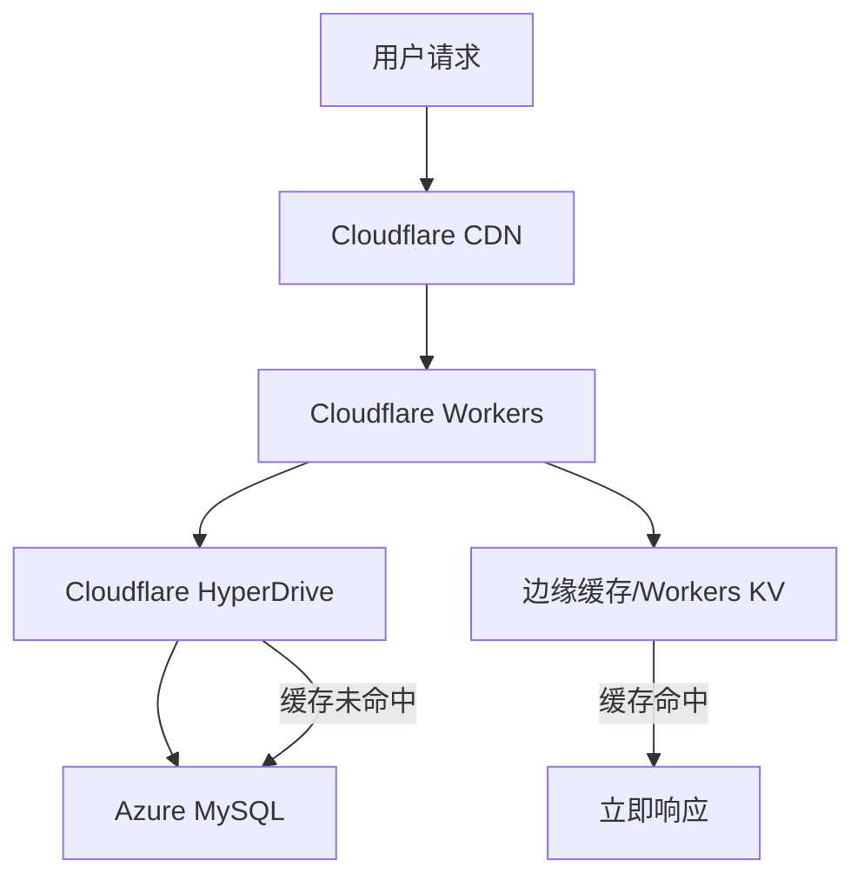
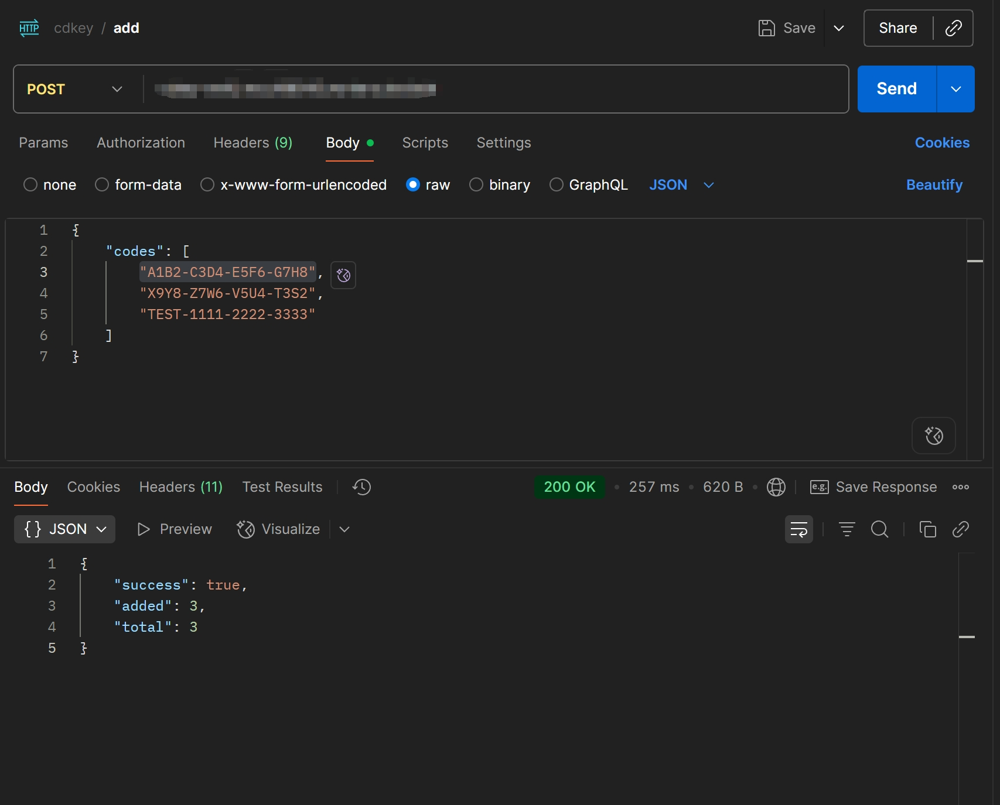
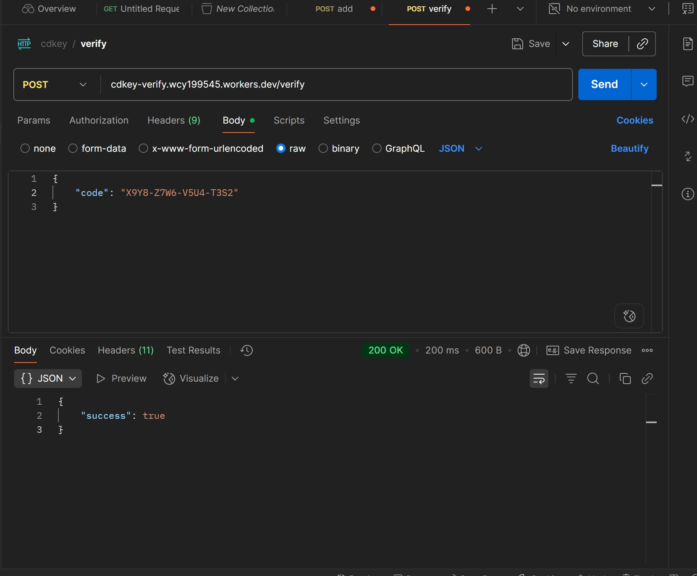
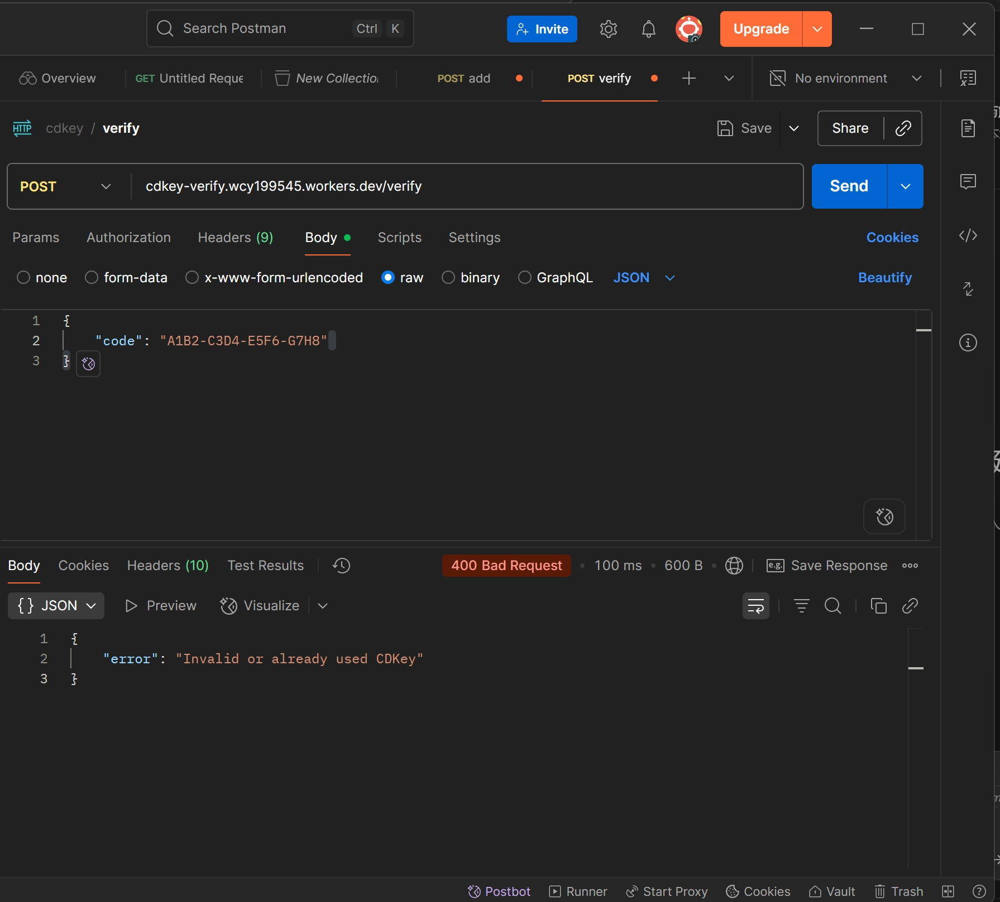

# 一、服务介绍
## 1. Cloudflare Pages and Workers
Cloudflare Workers 和 Cloudflare Pages 是 Cloudflare 开发者平台的两大核心组件。它们旨在通过 Cloudflare 的全球边缘网络，覆盖全球330多个城市，帮助开发者构建极速、可扩展且无需维护服务器的应用。
### 1.1 Cloudflare Workers：边缘计算平台
Cloudflare Workers 允许开发者在距离用户最近的边缘节点上运行代码（JavaScript, Rust, Python 等）。
- 技术原理： 不同于传统的容器或虚拟机，Workers基于V8 Isolates 技术。这使得它的启动速度极快，完全没有传统 Serverless，比如 AWS Lambda的“冷启动”延迟。
- 核心优势：
    - 极低延迟： 代码直接在用户附近的网关上运行。
    - 高并发： 轻松处理每秒数百万次的请求。
    - 成本极低： 免费额度慷慨（`每天10万次`请求），付费版起步价也很具竞争力。

### 1.2 Cloudflare Pages：前端托管与协作平台
Cloudflare Pages类似于Vercel或Netlify，是专门为前端开发者设计的静态网站托管和全栈应用平台。

## 2. Azure Database for MySQL
Azure Database for MySQL 是微软 Azure 提供的完全托管的关系数据库服务，基于 MySQL 社区版引擎构建，允许开发者在云端托管、管理和缩放MySQL数据库，而无需处理底层服务器基础设施。
### 2.1 优势
- 自动化运维：包含自动备份、Failover和时间点恢复。
- 高可用性：官方承诺`99.9%`的可用性，即月不可用时间`<43分钟`
- 性能智能化：提供查询性能见解，通过AI建议优化慢查询和索引。

## 3. Cloudflare HyperDrive
Cloudflare Hyperdrive 是一项专门为解决“边缘计算访问远程数据库延迟高”而设计的加速服务。它能让你部署在 Cloudflare Workers 上的无服务器应用，以接近本地速度访问位于全球任何地方的传统数据库。 
### 3.1 核心优势
- 连接池：传统数据库连接需要多次网络往返（TCP、TLS 及数据库认证）。Hyperdrive在Cloudflare网络中维持一个长连接池，将连接时间从`数百ms`降至`35ms`左右。

:::tip
实际延迟取决于数据库所在区域、查询复杂度和缓存命中率。
:::

- 智能查询缓存：自动识别读取查询，并将频繁请求的结果缓存至边缘节点。对于缓存命中的查询，延迟通常低于`5ms`，且不会消耗数据库性能。
- 网络路径优化：即使缓存未命中，Hyperdrive也会通过Cloudflare 的骨干网络优化路由，减少从Workers到源数据库的传输延迟。

# 二、代码设计与实现（最小实现）
先看架构图：

:::tip
本文最小实现未启用 KV，KV部分仅作为后续扩展思路
:::
目录结构如下：
```txt
.
├── package-lock.json
├── package.json
├── workers
│   └── cdkey.js
└── wrangler.toml
```
其中workers/cdkey.js是后端文件，wrangler.toml是配置文件
## 1. Node后端代码和Workers部署
Node后端代码：
```js
import mysql from "mysql2/promise";

export default {
  async fetch(request, env) {
    const url = new URL(request.url);

    if (request.method === "POST" && url.pathname === "/verify") {
      return handleVerify(request, env);
    }

    if (request.method === "POST" && url.pathname === "/add") {
      return handleAdd(request, env);
    }

    return new Response("Not Found", { status: 404 });
  },
};

/**
 * 创建 Hyperdrive MySQL 连接
 * ⚠️ 每次请求新建连接，Worker 不能做全局长连接
 */
async function getConnection(env) {
  return mysql.createConnection(env.HYPERDRIVE.connectionString);
}

/**
 * CDKey 验证（原子更新）
 */
async function handleVerify(request, env) {
  let conn;

  try {
    const { code } = await request.json();

    if (
      !code ||
      !/^[A-Z0-9]{4}(-[A-Z0-9]{4}){3}$/.test(code)
    ) {
      return json({ error: "Invalid CDKey format" }, 400);
    }

    conn = await getConnection(env);

    const escapedCode = conn.escape(code);

    const [result] = await conn.query(
      `UPDATE cdkeys
       SET is_used = 1, used_at = NOW()
       WHERE code = ${escapedCode} AND is_used = 0`
    );

    if (result.affectedRows === 1) {
      return json({ success: true });
    } else {
      return json(
        { error: "Invalid or already used CDKey" },
        400
      );
    }
  } catch (err) {
    console.error("verify error:", err);
    return json({ error: "Verification failed" }, 500);
  } finally {
    if (conn) await conn.end();
  }
}


/**
 * CDKey 批量上传（最多 100）
 */
async function handleAdd(request, env) {
  let conn;

  try {
    const { codes } = await request.json();

    if (!Array.isArray(codes) || codes.length === 0 || codes.length > 100) {
      return json(
        { error: "Invalid input: expect array of 1-100 codes" },
        400
      );
    }

    const validCodes = codes.filter((code) =>
      /^[A-Z0-9]{4}(-[A-Z0-9]{4}){3}$/.test(code)
    );

    if (validCodes.length === 0) {
      return json({ error: "No valid CDKeys found" }, 400);
    }

    conn = await getConnection(env);

    const values = validCodes
      .map((code) => `(${conn.escape(code)})`)
      .join(",");

    await conn.query(
      `INSERT IGNORE INTO cdkeys (code) VALUES ${values}`
    );

    return json({
      success: true,
      added: validCodes.length,
      total: codes.length,
    });
  } catch (err) {
    console.error("add error:", err);
    return json({ error: "Upload failed" }, 500);
  } finally {
    if (conn) await conn.end();
  }
}


/**
 * JSON Response helper
 */
function json(body, status = 200) {
  return new Response(JSON.stringify(body), {
    status,
    headers: { "Content-Type": "application/json" },
  });
}
```
## 2. 部署和配置Azure Database for MySQL
这部分没什么好说的，只需要登录Azure部署资源，其实只要能够被访问到，任何云厂商的MySQL数据库都一样。
唯一注意的点是需要将安全组设置为0.0.0.0（在测试或实验数据库可以），或者特定把CloudFlare IP地址加入为允许连接的IP（生产级实践）
:::tip
安全组设置为0.0.0.0建议只在测试、实验环境下；敏感、生产环境中请手动下载 [Cloudflare IP地址范围](https://www.cloudflare.com/ips-v4/) 
:::
### 创建数据库、表和索引
```sql
-- 创建数据库
CREATE DATABASE cdkey;
-- 创建数据表
CREATE TABLE `cdkeys` (`id` INT AUTO_INCREMENT PRIMARY KEY COMMENT '自增ID', `code` CHAR(19) NOT NULL COMMENT 'CDKey格式: A1B2-C3D4-E5F6-G7H8', `is_used` BOOLEAN NOT NULL DEFAULT 0 COMMENT '0=未使用, 1=已使用', `used_at` DATETIME NULL DEFAULT NULL COMMENT '使用时间') ENGINE=InnoDB DEFAULT CHARSET=utf8mb4;
-- 创建索引
CREATE UNIQUE INDEX idx_code ON cdkeys(code);
```
### 2.2 创建MySQL用户
```sql
-- 创建HyperDrive专属用户
CREATE USER 'hyperdrive_user'@'%' IDENTIFIED BY 'your_strong_password';
-- 授予指定表权限
GRANT SELECT, INSERT, UPDATE ON cdkey.cdkeys TO 'hyperdrive_user'@'%';
-- 刷新权限
FLUSH PRIVILEGES;
```
## 3. 配置CloudFlare HyperDrive
1. 创建HyperDrive连接，选择连接到公共数据库

2. 之后创建一个配置名称，并将数据库配置，包括hostnaem、username、port和password等信息填入
3. 点击创建，创建成功后再左上角会生成一个id，这个id将是worker用于连接到HyperDrive的唯一标识


## 4. wrangler配置
完成wrangler配置如下：
```toml
name = "cdkey-verify" # Workers应用名称
main = "workers/cdkey.js" # 主程序文件
compatibility_date = "2024-12-25"
compatibility_flags = ["nodejs_compat"] # 兼容Node应用

[[hyperdrive]]
binding = "HYPERDRIVE"
id = "your-hyperdrive-id"

# 以下是日志配置，启用日志便于debug
[observability]
enabled = false
head_sampling_rate = 1

[observability.logs]
enabled = true
head_sampling_rate = 1
persist = true
invocation_logs = true

[observability.traces]
enabled = false
persist = true
head_sampling_rate = 1
```
# 三、部署程序
## 1. 确保wrangler已安装
如果没有安装，使用npm安装
```bash
npm install -g wrangler
```
## 2. 登录CloudFlare
```bash
wrangler login
```
这一步会自动唤起浏览器并进入CloudFlare获取授权
## 3. Deploy
```bash
wrangler deploy
```
如果没有任何报错，则workers已经部署成功

# 四、使用Postman测试

## 1. 测试/add路由

添加CD-KEY成功

## 2. 测试CD-KEY验证


## 3. 测试重复激活已经使用的CD-KEY


## 4. 查看Workers页面


## 5. 查看日志


# 五、该架构解决了什么问题
1. 该架构以Serverless架构为主，配合丰富的边缘计算节点，可以实现95%流量都在边缘节点完成处理，极大降低了中心化架构的负载压力
2. 利用CloudFlare CDN可以实现页面的全球加速（虽然在这个例子中没使用Pages）
3. 由于主要流量都由边缘计算节点完成处理，这以为着核心的用户、支付网关可以获得更多的系统资源
4. 这种半Serverless架构几乎没有运维压力，95%的操作集中在网页点击上，并且唯一的服务器Azure Database也是高度自动化的。
5. 优秀的可扩展性 - 如果搭配Workers KV，还可以实现将不正确的CDKEY进行短期缓存，用户重复查询时立刻在边缘节点返回错误，完全不需要访问数据库。
6. 利用CloudFlare的DDoS防护体系，面对3.5Mpps的中等强度的DDoS几乎不会对服务本身产生任何影响，自动弹性防护成本也极低，甚至Free计划就已经足够。
7. 以极低成本获得全球超300个城市的边缘计算节点用户部署应用

# 六、头脑风暴：如何进一步提升性能？
## 1. 在边缘节点缓存已使用的CDKEY
简单来说就是在不访问中心数据库的情况下，尽快拒绝`必然失败`的请求；当`UPDATE`成功时，同步更新边缘缓存，比如Workers KV：
```js
await env.CACHE.put(code, "1", {expirationTtl: 86400})
```

## 2. 基于时间的发行、作废与判断机制
在边缘节点缓存已使用的CDKEY有一个缺点：如果系统的生命周期较长，则在生命周期后期可能需要缓存数十万乃至百万个已使用的CD-KEY，这样会导致同步成本极高、大量冷Key永远不会被访问却占用空间。

因此，可以将CDKEY的第一部分设置为发行时间，如`DA2YB5`代表这个CDKEY是在2025年12月9日发行的，那么当该日发行的CDKEY已经全部使用后，则可以在缓存同步删除所有以`DA2YB5`为开始的CDKEY，只保存一个`invalid_prefixes = {"DA2YB5"}`,这样便可以以一个6字节的字符前缀否定数万乃至更多的CDKEY，并且时间复杂度保持在O(1)、零IO、零误判、极低空间复杂度。
## 3. 引入Bloom Filter
由于CD-KEY的兑换机制有三个典型特征：
- 一旦使用就永久失效
- 没有状态回退
- 按批次发放和关闭

这个三个特点完美的补充了Bloom Filter无法删除元素的缺点
对于误判，由于根本上存在一个MySQL DB兜底，因此偶尔发生的误判不是严重问题，因为：
- 当误判一个失效CDKEY为有效时 - 查询一次数据库 - 发现已失效 - 返回兑换失败
- 但是当没有误判时，会直接驳回反复尝试的错误CDKEY、撞库、猜测请求，综合来看利大于弊
## 综合对比
|方案|优点|缺点|适用场景|
|:--:|:--:|:--:|:--:|
|边缘缓存已使用KEY|响应快，减少DB压力|缓存同步延迟，存储成本高|小型系统|
|时间前缀机制|空间效率高，时间复杂度低|设计复杂、需要配合实际CD-KEY发行商品做规划|大规模系统|
|Bloom Filter|空间效率极高|有误判率，无法删除|第二层验证/防暴力猜测|

# 七、总结
本文通过Cloudflare Workers与Hyperdrive构建边缘计算入口，并结合Azure MySQL作为中心化数据源，实现了一套低延迟、高并发、低运维成本的CDKEY验证架构。
该方案将绝大多数请求处理下沉至边缘节点，有效缓解了数据库连接数与网络延迟问题，同时保持了数据一致性与系统可扩展性。
在此基础上，配合边缘缓存、时间前缀与 Bloom Filter等机制，可进一步提升系统在大规模、高攻击场景下的性能与稳定性。

